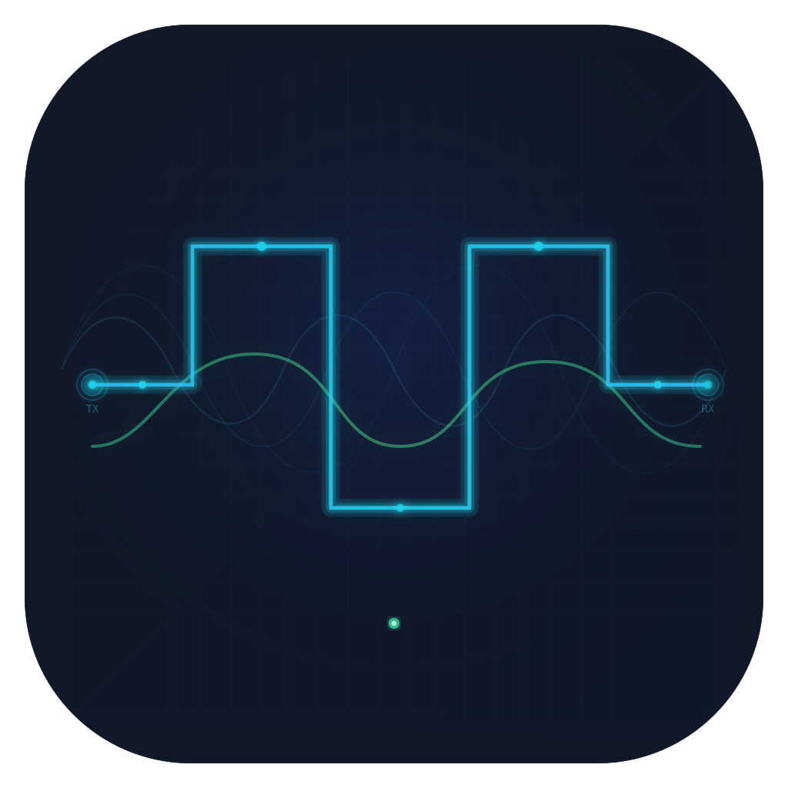
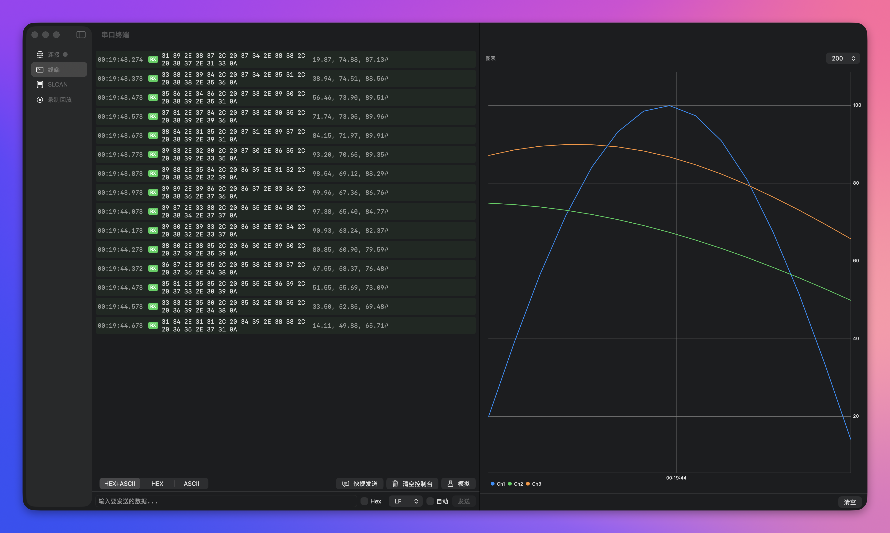
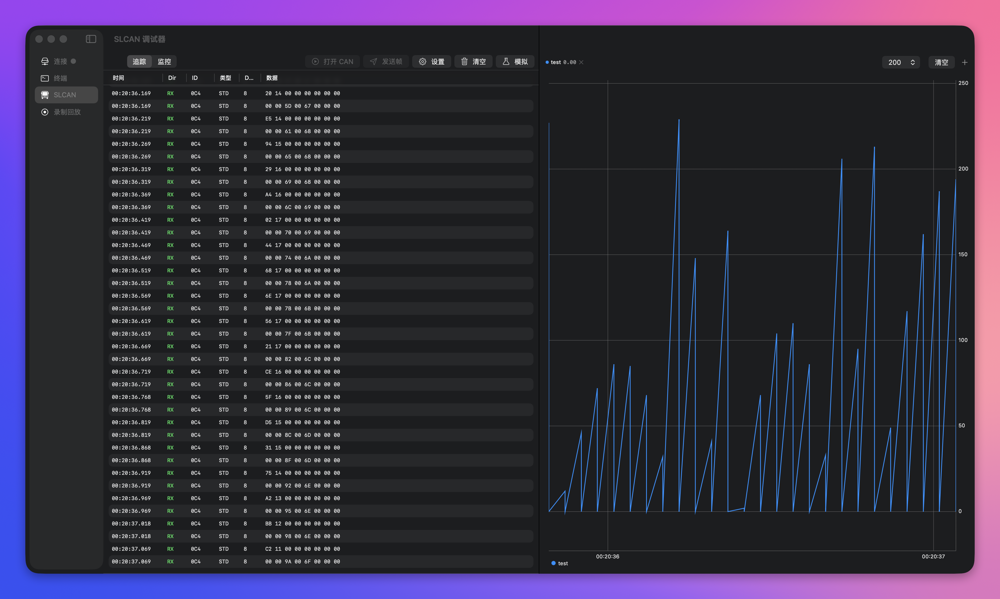

#  Baud

macOS 原生串口调试工具，支持 SLCAN（CAN 总线）、实时示波器、数据录制回放。SwiftUI 构建。

## 功能

**串口终端**



- **串口终端** — Hex/ASCII 混合显示，自动发送，快捷预设
- **连接页** — 波形动画随串口配置参数实时变化
- **实时示波器** — 基于 DGCharts，多通道折线图，缩放/拖拽，自动 Y 轴缩放
- **数据录制回放** — 录制串口会话，进度条拖拽回放

**SLCAN 调试器**



- **CAN 帧追踪/监控** — 双模式切换
- **信号提取** — 位级解析，大小端，有符号/无符号，系数/偏移

- **中英双语** — 简体中文 + English

## 环境要求

- macOS 26 (Tahoe)
- Xcode 26
- Swift 6.2

## 构建与运行

```bash
swift build
./build-app.sh --run
```

`build-app.sh` 将 SPM 产物打包为 `.app`（本地化资源必须通过 .app bundle 加载）。

### 绕过 macOS Gatekeeper

构建产物未签名，首次打开会被 Gatekeeper 拦截。运行以下命令解除限制：

```bash
xattr -cr .build/arm64-apple-macosx/debug/Baud.app
```

## 架构

```
Baud (应用目标)
 └─ BaudKit (库目标)
     ├─ Models/        — SerialPortConfig, CANFrame, CANSignal, RecordedSession
     ├─ Services/      — SerialPortManager, SerialDataManager, SLCANManager,
     │                   CANFrameStore, CANSignalStore, SessionRecorder, SessionManager
     ├─ Views/
     │   ├─ Connection/    — 配置表单 + 波形动画
     │   ├─ SerialTerminal/— 控制台、示波器、发送栏、快捷发送
     │   ├─ SLCANDebugger/ — 帧列表/监控、示波器、信号配置
     │   └─ Recorder/      — 录制、回放、会话管理
     └─ Resources/     — en.lproj / zh-Hans.lproj 本地化字符串
```

### 数据流

```
SerialPortManager (ORSSerialPort 封装)
  ├─→ SerialDataManager → 控制台显示 + 图表解析 + 会话录制
  └─→ SLCANManager → CANFrameStore (追踪/监控) + CANSignalStore (图表)
```

### 依赖

| 库 | 版本 | 用途 |
|---|---|---|
| [ORSSerialPort](https://github.com/armadsen/ORSSerialPort) | 2.1.0 | USB CDC 串口通信 |
| [DGCharts](https://github.com/ChartsOrg/Charts) | 5.1.0 | 实时折线图 |

## 许可证

GPL-3.0
